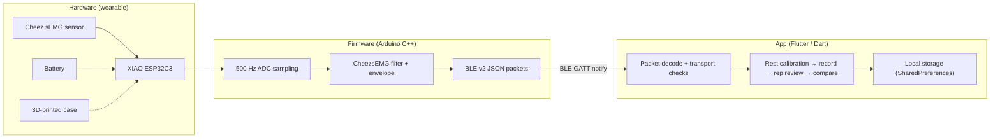

# My_EMG (MyEMG) — Within-session Muscle-Activation Monitor

A low-cost wearable surface-EMG (sEMG) system that compares the local muscle
activity of different exercises **within a single electrode-placement and
calibration session**. Built around a Seeed Studio XIAO ESP32C3, a Cheez.sEMG
sensor, and a Flutter app.

> **Positioning (Route A — within-session comparison):** MyEMG answers *"under
> this one placement and this one relaxed calibration, which of these actions
> drives more local EMG activity right now?"* It is **not** an MVC / percent-of-
> maximum meter, **not** a cross-day or cross-session ranking, and **not** a
> medical, diagnostic, or training-prescription tool.

- **Website:** <https://zcheng0319-dot.github.io/Muscle-Activation-Monitor/>
- **Context:** UCL CASA0022 — MSc Connected Environments dissertation project
- **License:** MIT

---

## Overview

Surface-EMG amplitude is not an absolute quantity. It shifts with electrode
placement, skin/electrode contact, calibration, and signal quality, so raw
envelope values cannot be compared reliably across different sessions or days.
Reporting a "percent of maximum voluntary contraction" would require assumptions
this hardware and protocol do not support.

MyEMG deliberately restricts the claim to what the signal can actually justify.
Inside one uninterrupted session — same electrodes, same placement, one relaxed
baseline — the device streams a local EMG envelope while the user records a
small set of actions. Every action is measured against the *same* session
baseline, so the app can order those actions by their local activity **for that
session only**. Moving the electrodes, recalibrating, or starting a new session
invalidates any comparison to a previous one.

---

## Features

- **Within-session comparison** — pick a target muscle and 2–4 actions, then
  compare them under one unchanged placement and one calibration.
- **One relaxed (rest) calibration** — a single baseline + noise estimate is
  captured at rest and reused for every action in the session.
- **Real-time envelope feedback** — a live adjusted-envelope curve and reading
  during recording (feedback only; not the final score).
- **Rep review** — detected repetitions are segmented automatically; the user
  can correct the rep count or discard and retest an action before accepting it.
- **Signal-quality gates** — action windows are flagged/invalidated for packet
  loss, ADC clipping, or missing quality data (see grading rules below).
- **Exercise catalog** — a local, editable library of muscles and actions
  (defaults provided), stored on device.
- **Recent comparisons** — the latest **8** completed sessions are kept locally
  as read-only history. Aborted sessions are not saved.
- **Local-only storage** — everything persists through `SharedPreferences`.
  There is no cloud/Firebase backend and no account.

---

## System architecture

Three layers: a wearable sensor node, firmware on the ESP32C3, and a Flutter
mobile app connected over Bluetooth Low Energy.



- **Hardware:** a Cheez.sEMG analog sensor feeding the XIAO ESP32C3 ADC (pin
  `D0`), battery powered, in a 3D-printed case designed to attach to the limb.
  This build has no wear-detection wire, so no "not worn" state is inferred.
- **Firmware:** Arduino C++ using the `CheezsEMG` v1.0.2 library. It samples at
  500 Hz, produces the official (non-RMS) envelope, runs the rest-calibration
  state machine, and streams BLE v2 JSON packets.
- **App:** Flutter/Dart with Riverpod state management and `flutter_blue_plus`
  for BLE. It owns the comparison workflow, rep segmentation, quality gating,
  exercise catalog, and history.

---

## BLE v2 protocol

The firmware advertises as a single GATT service with one characteristic that
carries notifications (device → app) and accepts writes (app → device, for
commands).

| Item | Value |
|---|---|
| Device name | `My_EMG` (second unit: `myemg2`) |
| Service UUID | `4fafc201-1fb5-459e-8fcc-c5c9c331914b` |
| Characteristic UUID | `beb5483e-36e1-4688-b7f5-ea07361b26a8` |
| Properties | `READ` · `NOTIFY` · `WRITE` |
| MTU | 128 (requested) |

Every packet is UTF-8 JSON carrying `"v":2`. The first `v:2` packet fixes the
connection as protocol v2 for its lifetime; a connected device that never sends
`v:2` is treated as legacy and the app asks the user to update the firmware
before comparing.

**Sample packet** — emitted at ~50 Hz (one every 20 ms):

```json
{"v":2,"type":"sample","env":36,"deviceMs":1234,"seq":12}
```

`env` is the unnormalized local EMG envelope, `deviceMs` is the device
`millis()` timestamp (uint32), and `seq` is a monotonic sequence counter the app
uses to detect dropped notifications and device restarts.

**Quality packet** — emitted once per second:

```json
{"v":2,"type":"quality","deviceMs":1234,"rawSamples":500,"nearRailSamples":0,"clipRatio":0.000000}
```

`clipRatio = nearRailSamples / rawSamples` reports how many raw ADC samples in
the window were at/near either rail, which the app uses to invalidate clipped
action windows (the raw envelope alone cannot reveal this).

**Calibration packets** — sent as the rest-calibration state machine advances:

```json
{"v":2,"type":"calibration","state":"preparing"}
{"v":2,"type":"calibration","state":"collecting_rest"}
{"v":2,"type":"calibration","state":"complete","baseline":128,"noise":6,"quality":"good"}
{"v":2,"type":"calibration","state":"failed","reason":"clipping_detected"}
```

Failure reasons come from the firmware calibration gates:
`insufficient_samples`, `clipping_detected`, `unstable_baseline`, and
`internal_error`.

**Command (app → device):** writing the ASCII string `calibrate_rest` to the
characteristic starts a rest calibration. The firmware prepares for ~2 s, then
collects a relaxed baseline for ~3 s and reports `complete` or `failed`. The
firmware intentionally does not compute MVC percentages, activation percentages,
reps, scores, or rankings.

---

## Getting started

### Firmware

1. Install the [Arduino IDE](https://www.arduino.cc/en/software) and the
   **ESP32 Arduino** board support package.
2. Select the board **Seeed Studio XIAO ESP32C3**
   (`esp32:esp32:XIAO_ESP32C3`).
3. Install the **CheezsEMG** library (`v1.0.2`) via the Library Manager.
4. Open `firmware/xiao_esp32c3_emg_ble/xiao_esp32c3_emg_ble.ino`, wire the
   Cheez.sEMG analog output to `D0`, and flash the board.
5. For a second unit, change `DEVICE_NAME` (`My_EMG` → `myemg2`) before
   flashing. The app scans by name (both names float to the top of the scan
   list) but connects and rebinds by BLE remote ID.

### App

Requires the Flutter SDK (Dart SDK `^3.12.1`).

```bash
cd app
flutter pub get
flutter run        # run on a connected device / emulator
flutter test       # run the unit/widget tests
flutter analyze    # static analysis / lints
```

BLE requires a physical phone with Bluetooth enabled; on Android the app
requests the nearby-devices / Bluetooth (and, on older versions, location)
permissions on first scan.

---

## Usage

A typical session:

1. **Connect** the device on the *Devices* tab (scan → pick `My_EMG` /
   `myemg2`). The app remembers the bound device for quick reconnects.
2. **Set up the comparison** on the *Compare* tab: choose a target muscle and
   **2–4 actions** from the catalog, and order them.
3. **Calibrate at rest** once — keep the muscle relaxed while the device
   captures the session baseline and noise.
4. **Record each action** in turn, using the live envelope feedback. Move at
   your own rhythm.
5. **Review reps** for each action: accept the detected count, **correct** it,
   or **discard and retest** the action.
6. **Compare** the valid actions of this session, ordered by their
   repetition-level local EMG metric (the median of each action's valid
   rep-level adjusted-envelope means).
7. Browse **Recent comparisons** to revisit the latest 8 completed sessions.

---

## Signal quality & limitations

**Quality gating (app side).** After each recorded action the app assigns an
invalid reason if any of the following hold, in order: packet loss detected
(`packet_loss_detected`), clipping over the threshold (`clipping_detected`),
no quality data received (`quality_unavailable`), or rep segmentation failed.

**Clipping is graded, not binary.** Clipping is measured as the maximum
`clipRatio` seen during the action window, against `kMaximumActionClipRatio =
0.05`:

- `clipRatio > 5%` → the action is **invalidated** (`clipping_detected`) and
  excluded from the comparison.
- `0% < clipRatio ≤ 5%` → the action stays **usable but carries a minor-clipping
  warning** so the user knows the signal touched the ADC limit.
- `clipRatio == 0%` → clean.

**Scope limitations (by design):**

- **Within-session only.** Comparisons are valid only inside one uninterrupted
  placement + calibration. Any electrode move or recalibration voids
  cross-session comparison.
- **Not muscle-force percentage.** The metric is a local adjusted envelope, not
  MVC %, not activation %, and not a physiological force estimate.
- **Not a universal ranking.** Higher local EMG for an action here does not prove
  it is universally "better" or predicts hypertrophy.
- **Not medical / not prescriptive.** This is a dissertation prototype, not a
  medical device or a training-prescription tool.
- **No wear detection.** The hardware has no wear-detection line, so the system
  never claims to know whether electrodes are attached.

---

## Repository structure

```
Muscle-Activation-Monitor/
├── firmware/
│   └── xiao_esp32c3_emg_ble/     # Arduino C++ firmware (BLE v2, 500 Hz, calibration)
├── app/                          # Flutter app
│   └── lib/features/
│       ├── comparison/           # rep segmentation, comparison controller, catalog, history
│       └── devices/              # BLE scan/connect, v2 packet decoding, transport checks
├── docs/
│   └── m0-validation-report.md   # M0 signal-chain validation (envelope, clipping/near-rail)
├── website/                      # GitHub Pages project site
├── LICENSE
└── README.md
```

Signal-chain facts (envelope definition, clipping/near-rail behavior, sampling
stability, and the provisional calibration gates) are documented in
[`docs/m0-validation-report.md`](docs/m0-validation-report.md).

---

## Limitations & future work

- **Provisional calibration thresholds.** The firmware rest-calibration gates
  (minimum samples, clip ratio, baseline-drift fraction) are engineering
  starting points from M0 and are intended to be retuned against physical
  hardware data.
- **Client-side delivery telemetry.** Notification loss is monitored at runtime
  via `seq` gaps rather than proven by a dedicated delivery test; actions with
  detected packet loss are rejected.
- **Single-channel, single muscle group per session.** The workflow targets one
  muscle and a small action set per session by design.
- **Prototype hardware.** ADC range and clipping behavior depend on the specific
  sensor/board configuration; heavy contractions can reach the ADC rails.

---

## Acknowledgements

- **Author:** Cheng Zhong — UCL CASA0022, MSc Connected Environments.
- **Sensor / library:** [CheezsEMG](https://github.com/CheezCheez/CheezsEMG)
  (`v1.0.2`, MIT), used for the analog EMG filter and envelope.
- **Hardware:** Seeed Studio XIAO ESP32C3.

## License

Released under the **MIT License** — Copyright (c) 2026 zcheng0319-dot. See
[`LICENSE`](LICENSE) for the full text.
