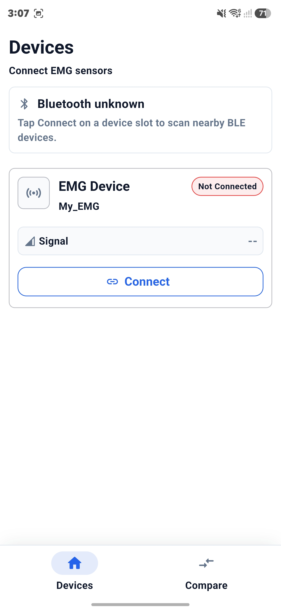
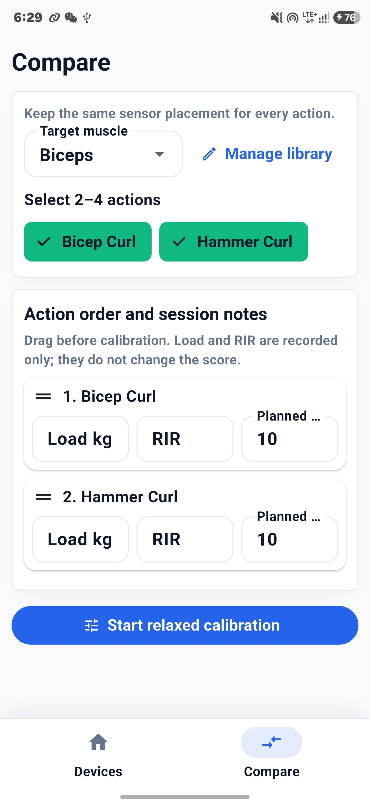
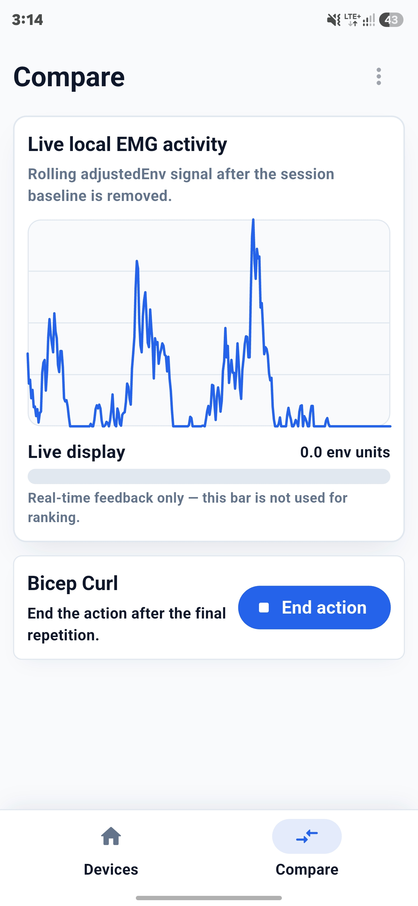
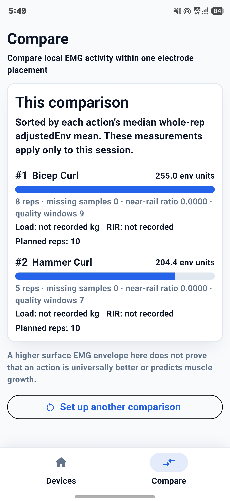
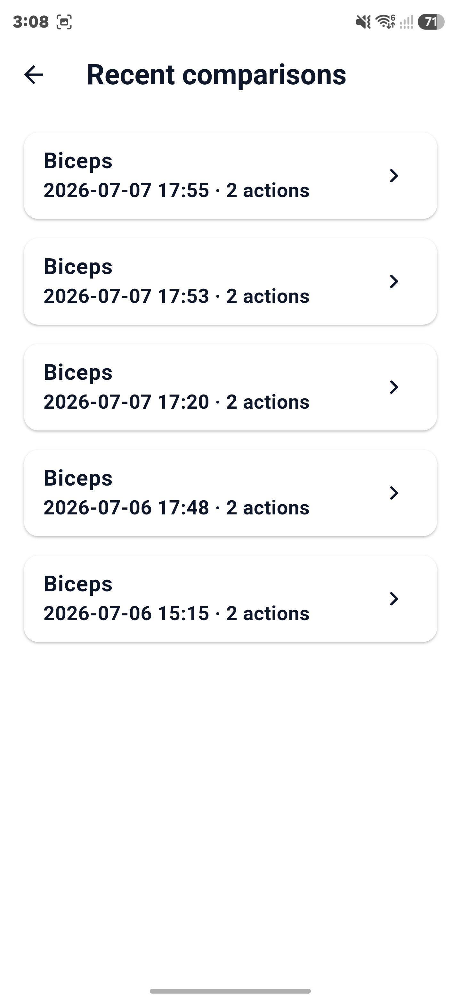
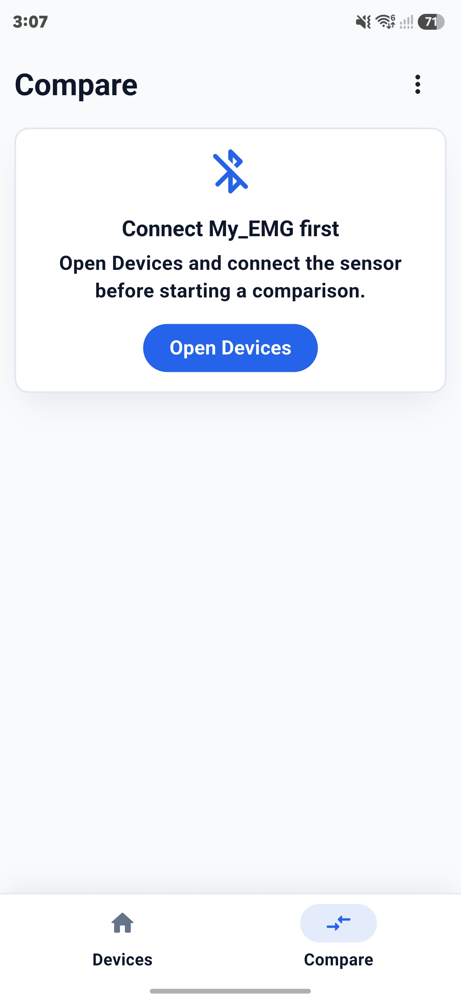

# MyEMG — Flutter App

Flutter client for **My_EMG**: connects to the sEMG sensor over BLE and runs same-session action comparisons (Route A — relative comparison within one electrode placement, not MVC, not a medical device).

Full project background (system overview, firmware, BLE protocol): see the [root README](../README.md).

## Screenshots

| Connect device | Set up comparison | Record envelope |
| :---: | :---: | :---: |
|  |  |  |

| Session results | Recent comparisons | Connect-first prompt |
| :---: | :---: | :---: |
|  |  |  |

## Quick start

```bash
flutter pub get
flutter run       # real device required (BLE)
flutter test
flutter analyze
```

BLE needs a physical phone. On Android, grant the Bluetooth (and on older versions, Location) permissions when prompted.

## Features

- Same-session action comparison (2–4 actions, one electrode placement)
- Relaxed (resting) calibration before recording
- Real-time envelope display while recording
- Per-rep review before an action is scored
- Editable action library per target muscle
- History of the 8 most recent comparison sessions
